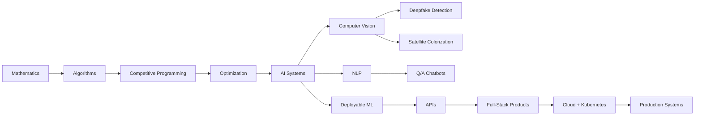

<div align="center">


</div>
<a href="https://git.io/typing-svg">
  
</a>

<br/>


<br/><br/>

<a href="mailto:srijanroysr10@gmail.com">
  
</a>
<a href="https://github.com/SrijanRoy123-github">
  
</a>

</div>

---

## 🧬 System Boot

```txt
┌──────────────────────────────────────────────────────────────────────┐
│ USER        : Srijan Roy                                              │
│ UNIVERSITY  : Jadavpur University                                     │
│ DEGREE      : B.Tech in Electronics & Telecommunication Engineering   │
│ MODE        : Full-Stack Builder + AI/ML Researcher + CP Enthusiast   │
│ INTERESTS   : CV | NLP | Graph Theory | Game Theory | Optimization    │
│ CURRENT ARC : Deepfake Detection | SAAR Colorization | IoTA Web/AI    │
└──────────────────────────────────────────────────────────────────────┘
```

I build **production-ready full-stack systems** and work on **applied AI/ML research** across computer vision, NLP, satellite imagery, deepfake detection, graph/game theory, and AI-driven optimization.

I like building projects where **research meets real engineering** — models that can be trained, evaluated, deployed, scaled, and actually used.

---

## 🎮 Choose Your Quest

<table>
<tr>
<td width="50%">

### 🧠 AI / ML Research Mode

```diff
+ Computer Vision
+ Deepfake Detection
+ Satellite Image Colorization
+ NLP Sentiment Analysis
+ Q/A Systems
+ HEP Quark Classification
+ AI-driven Optimization
```

</td>
<td width="50%">

### 🏗️ Full-Stack Architect Mode

```diff
+ React / Angular / Vue
+ Node.js / Express / NestJS
+ Django / Flask / DRF
+ Spring Boot / Laravel / ASP.NET Core
+ PostgreSQL / MongoDB / Elasticsearch
+ Docker / Kubernetes / CI/CD
```

</td>
</tr>
<tr>
<td width="50%">

### ⚔️ Competitive Programming Mode

```diff
+ Graph Theory
+ Game Theory
+ Dynamic Programming
+ Greedy Algorithms
+ Mathematical Reasoning
+ C++ Speed Coding
```

</td>
<td width="50%">

### 🚁 IoTA Builder Mode

```diff
+ IoT Applications Club Website
+ AI Initiatives
+ Research Roadmaps
+ Vision + Hardware Projects
+ Technical Leadership
+ Club Systems & Documentation
```

</td>
</tr>
</table>

---

## 🕹️ Player Stats

<div align="center">

<table>
<tr>
<td align="center" width="25%">

<br/><br/>
<b>CV • NLP • Optimization</b>
</td>
<td align="center" width="25%">

<br/><br/>
<b>Frontend • Backend • Cloud</b>
</td>
<td align="center" width="25%">

<br/><br/>
<b>Graphs • DP • Game Theory</b>
</td>
<td align="center" width="25%">

<br/><br/>
<b>Web • AI • Leadership</b>
</td>
</tr>
</table>

</div>

---

## 🌌 Tech Galaxy

<div align="center">

### Languages


<br/><br/>

### Frontend


<br/><br/>

### Backend


<br/><br/>

### AI / ML / Data


<br/><br/>


<br/><br/>

### Databases / Search / DevOps


<br/><br/>

### Other Tools


</div>

---

## 🧪 AI / ML Research Lab

<div align="center">

<table>
<tr>
<td width="50%">

### 🛰️ SAAR Image Colorization


Encoder-decoder CNN pipelines for grayscale → color satellite tiles using **EfficientNet-B2**, **ResNet-50**, and **MobileNetV2** backbones.

```txt
Metric Highlight  : IoU up to ~0.95
Regions           : Atlantic / Amazon subsets
Focus             : Colorization + remote-sensing representation
```

</td>
<td width="50%">

### 🕵️ Deepfake Detection


Landmark-guided deepfake detection pipeline using facial geometry and temporal inconsistencies across benchmark datasets.

```txt
Datasets          : UADFV / DFD / CelebDFv2 / DFDC
Metric Highlight  : AUC ~0.92
Focus             : Cross-dataset generalization
```

</td>
</tr>

<tr>
<td width="50%">

### 🧠 NLP Sentiment Analysis


Built sentiment models using classical vectorization and neural sequence modeling.

```txt
Dataset           : IMDB
Accuracy          : ~90%
F1                : ~0.88
```

</td>
<td width="50%">

### 🤖 Custom Q/A Chatbot


Fine-tuned transformer-based Q/A system with a lightweight API and deployable web interface.

```txt
Core              : DistilBERT fine-tuning
Backend           : Flask API
Frontend          : Streamlit UI
```

</td>
</tr>

<tr>
<td width="50%">

### 🖼️ CIFAR-10 Image Classification


Training pipelines with augmentation, learning-rate scheduling, and evaluation discipline.

```txt
Dataset           : CIFAR-10
Test Accuracy     : ~94%
```

</td>
<td width="50%">

### ⚛️ Quark Detection in HEP


CNN-based quark type identification using CERN Zenodo datasets.

```txt
Task              : Quark classification
Stack             : MATLAB DL Toolbox + TensorFlow
Focus             : Scientific ML
```

</td>
</tr>
</table>

</div>

---

## 🏗️ Full-Stack Systems

<div align="center">

<table>
<tr>
<td width="50%">

### 🛒 CollabCommerce Cloud


A multi-SPA e-commerce cloud system with polyglot services, checkout, search, and CI/CD.

```txt
Frontend          : React / Angular / Vue
Backend           : Node / NestJS / Django / Spring / Laravel / ASP.NET
Infra             : GitHub Actions / Elasticsearch / Stripe
```

</td>
<td width="50%">

### ☁️ Cloud Resume — IBM Capstone


Cloud-native resume platform with authenticated APIs, object storage, Dockerization, and Kubernetes deployment.

```txt
Frontend          : React SPA
Backend           : Flask API
Deployment        : Docker + Kubernetes + IBM Cloud Object Storage
```

</td>
</tr>

<tr>
<td width="50%">

### 🌐 IoT Applications Club Website


A responsive, animated, multi-page club website for events, projects, and team identity.

```txt
Focus             : Responsive UX
Animation         : GSAP
Pages             : Events / Projects / Team
```

</td>
<td width="50%">

### ✅ Kubernetes ToDo API


Containerized REST API deployed using Kubernetes Deployments and Services.

```txt
Service           : Flask REST CRUD
Runtime           : Docker
Cluster           : Minikube
```

</td>
</tr>
</table>

</div>

---

## 🧩 Boss Fight Map



---

## 🧠 Current Skill Tree

<table>
<tr>
<td width="33%">

### AI / Research

```txt
Computer Vision      █████████░ 90%
Deepfake Detection   █████████░ 90%
NLP                  ████████░░ 80%
Optimization         ████████░░ 80%
Scientific ML        ███████░░░ 70%
```

</td>
<td width="33%">

### Engineering

```txt
Full-Stack Systems   █████████░ 90%
Backend APIs         █████████░ 90%
Frontend UX          ████████░░ 80%
Databases/Search     ████████░░ 80%
Cloud/DevOps         ███████░░░ 70%
```

</td>
<td width="33%">

### Problem Solving

```txt
C++                  █████████░ 90%
Graph Theory         ████████░░ 80%
Game Theory          ████████░░ 80%
DP/Greedy            ████████░░ 80%
Math Logic           ███████░░░ 70%
```

</td>
</tr>
</table>

---

## 📊 GitHub Control Room

<div align="center">


<br/><br/>


<br/><br/>


<br/><br/>


</div>

---

## 🏆 Achievement Cabinet

<div align="center">


</div>

---

## 🧬 Contribution DNA

<div align="center">


</div>

---

## 🎯 What I Like Building

<div align="center">

<table>
<tr>
<td align="center" width="20%">

<br/><b>AI Systems</b>
</td>
<td align="center" width="20%">

<br/><b>Full-Stack Apps</b>
</td>
<td align="center" width="20%">

<br/><b>Remote Sensing</b>
</td>
<td align="center" width="20%">

<br/><b>Computer Vision</b>
</td>
<td align="center" width="20%">

<br/><b>Graph Theory</b>
</td>
</tr>
</table>

</div>

---

## 🧑‍💻 Competitive Programming Arena

<div align="center">

<table>
<tr>
<td width="33%" align="center">

### ⚔️ Graphs

```txt
Shortest Paths
Trees
DFS / BFS
DSU
MST
Flows
```

</td>
<td width="33%" align="center">

### 🧩 DP

```txt
Knapsack
Digit DP
Tree DP
Bitmask DP
Optimization DP
```

</td>
<td width="33%" align="center">

### ♟️ Game Theory

```txt
Nim
Grundy
Minimax
Sprague-Grundy
Strategy Games
```

</td>
</tr>
</table>


</div>

---

## 🚀 IoTA JU Mission Console

<div align="center">


</div>

```txt
Role       : Leading Web / AI initiatives
Mission    : Build strong technical culture around IoT, AI, CP, and systems
Focus      : Club website, project showcases, documentation, AI research directions
Next Arc   : IOTA AI × CODE IOTA
```

---

## 🧭 Operating Principles

```txt
01. Build things that work beyond notebooks.
02. Train models, but also deploy and monitor them.
03. Make research understandable, reproducible, and useful.
04. Treat algorithms like weapons and systems like architecture.
05. Keep learning from math, code, papers, failures, and people.
```

---

## 📡 Connect With Me

<div align="center">

<a href="mailto:srijanroysr10@gmail.com">
  
</a>
<a href="https://github.com/SrijanRoy123-github">
  
</a>

<br/><br/>


</div>

---

<div align="center">


</div>
````
